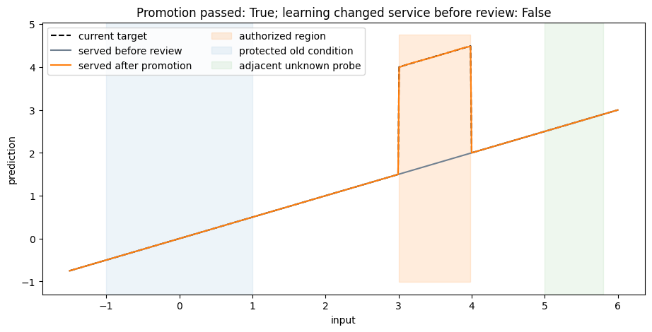
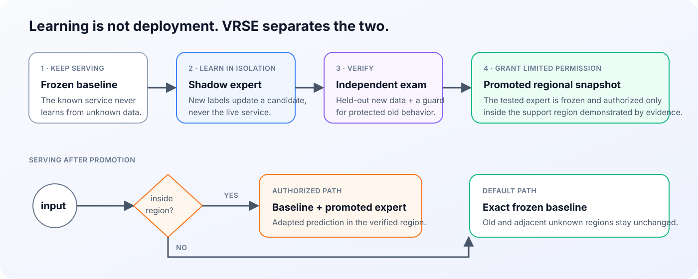

# VRSE

### Let PyTorch models continually learn without breaking what already works.

Validated Regional Support Expansion (VRSE) is a continual-learning core
research prototype that keeps the existing model as the default service,
trains new behavior in isolation, and enables it only after it passes held-out
evaluation — and only for inputs supported by the available evidence.

> **Status: research alpha / reference implementation.** The current release
> validates the lifecycle and routing mechanism for supervised scalar regression
> and one 24-dimensional case study.

[Run the quickstart](#quickstart) ·
[Experience the lifecycle](#experience-the-full-lifecycle) ·
[See the evidence](#experimental-evidence) · [Read the theory](docs/THEORY.md) ·
[中文说明](README.zh-CN.md)

## Core idea: update in new regions, fall back in known regions — autonomously



*Notebook demo: on an illustrative 1D fitting task with continuously arriving
data, VRSE improves the new condition while the protected old condition and
adjacent unknown inputs remain on the baseline.*

## Quickstart

```bash
python -m pip install -e .
python -m examples.quickstart
```

Drop into a continual learning loop:

```python
from vrse import VRSEConfig, VRSEModel

# 1. Deploy — freeze the known service
model = VRSEModel.wrap(baseline, VRSEConfig(preset="regional_regression_highdim"))
model.fit(x_id, y_id, x_id_calibration)  # in-domain data (known, trusted data)

# 2. Serve — route automatically; buffer what looks unfamiliar
for x_live in stream:
    y_hat = model(x_live)                     # expert where authorized, baseline elsewhere
    unfamiliar = model.review_mask(x_live)     # outside current support → hold for review
    buffer.store(x_live[unfamiliar])

# 3. Review — when labels arrive (hours or days later)
buffer.attach_labels(sample_ids, y_delayed)
if buffer.ready():
    learn, exam = buffer.take_labeled_disjoint()
    model.observe(learn.x, learn.y)           # train candidate in isolation
    proposal = model.evaluate(                # exam on new data + guard on old data
        exam.x, exam.y, guard_x=x_id_guard,
    )
    model.promote(proposal)                   # pass → authorize; fail → discard
```

Observations and labels are independent events joined by sample ID. The outer
system manages the buffer and schedule; VRSE handles learning, review,
promotion, and routing.

The deterministic example reports the events that matter:

```text
VRSE lifecycle check
  Candidate learned in isolation       yes
  Served model changed before review   no
  Useful candidate promoted            yes
  Supported-region RMSE improved       yes (2.500 → 0.003)
  Harmful candidate promoted           no
  Old behavior changed                 no
  Unknown inputs changed               no
  Revoke restored previous snapshot    yes
  Supported inputs routed to candidate 100.0%
```

See [`examples/continual_stream.py`](examples/continual_stream.py) for batched
stream arrival, [`examples/custom_model.py`](examples/custom_model.py) for
wrapping a user model, and [`examples/cmapss_fd002.py`](examples/cmapss_fd002.py)
for the case-study lifecycle.

## Experience the full lifecycle



1. The baseline keeps serving while labelled data from a new condition arrives.
2. A shadow candidate learns in isolation; live outputs do not change.
3. Held-out data tests utility; a guard set tests overlap with protected
   conditions.
4. A useful candidate is frozen and authorized only in its supported region.
5. Old and adjacent unknown inputs continue to use the exact baseline.
6. A harmful candidate is rejected; `revoke()` restores the previous snapshot.

> Learning can happen continuously; serving new behavior remains an explicit,
> evidence-gated decision.

For the executable walkthrough behind the opening result, open
[`notebooks/vrse_lifecycle.ipynb`](notebooks/vrse_lifecycle.ipynb).

## VRSE Theory and Mechanism

**The Industrial Problem.** In safety-critical or stable production systems, updating a global model $f_0(x)$ couples two decisions: learning from a new stream, and immediately changing the behavior for all future inputs. VRSE formally separates *learning* from the *permission to serve*.

**Formalizing the Service.** Let $f_0: \mathcal{X} \rightarrow \mathbb{R}$ be the immutable baseline. Labelled review data flows into a shadow residual candidate $e^\star(x)$ that is strictly quarantined. After held-out evaluation, a successful candidate is promoted into a deployment snapshot $t$, consisting of a frozen expert $e_t$ and an explicit authorized region $A_t \subseteq \mathcal{X}$.

The served function is mathematically guaranteed to be:

$$
F_t(x) =
\begin{cases}
f_0(x) + e_t(x), & x \in A_t, \\
f_0(x), & x \notin A_t.
\end{cases}
$$

**The Asynchronous Lifecycle.**

1. **Data Collection (Review Mask):** The baseline maintains an uncertainty score $u_0(x)$ calibrated to a threshold $\tau_0$. The live system holds inputs for delayed labelling only when they fall outside both the baseline's familiar range and the current route coverage:

$$
R_t(x) = \mathbf{1}[u_0(x) > \tau_0]\,\mathbf{1}[x \notin A_t]
$$

2. **Promotion Pipeline:** Once labels arrive, the outer MLOps system drives the state machine:

$$
D_{\mathrm{obs}} \quad \overset{\mathrm{observe}}{\longrightarrow} \quad e^\star \quad \underset{D_{\mathrm{val}}, D_{\mathrm{guard}}}{\overset{\mathrm{evaluate}}{\longrightarrow}} \quad P^\star \quad \overset{\substack{\mathrm{promote}\\\text{if }P^\star.\mathrm{passed}}}{\longrightarrow} \quad (e_t, A_t)
$$

`observe()` mutates only the shadow without touching the live service. `evaluate()` tests the candidate's utility on held-out new data ($D_{\mathrm{val}}$) and checks whether the proposed region routes the supplied guard inputs ($D_{\mathrm{guard}}$) to the expert or changes their outputs. `promote()` atomically installs a passing snapshot.

**Five System Invariants.** The implementation structurally enforces: (i) **shadow non-interference** (learning never alters served outputs); (ii) **exact fallback** (outside $A_t$, the residual is algebraically zero); (iii) **proposal binding** (stale or forged exams are rejected); (iv) **atomic promotion**; and (v) **one-step rollback**.

For full definitions, data-role constraints, and statistical boundaries, see [`docs/THEORY.md`](docs/THEORY.md).

## Experimental evidence

The representative study uses **NASA C-MAPSS FD002**, an industrial simulation
benchmark for turbofan remaining-useful-life prediction (3 operating settings,
21 sensor values per observation). It is simulated data, not field data from
operating aircraft.

Entire engines were assigned to disjoint fit, calibration, observation,
validation, guard, and post-decision roles. Five fixed seeds were evaluated
under two paired conditions:

- **stable:** the new operating regime remains learnable;
- **reversed:** validation labels are inverted to create a candidate that
  should not be promoted.

| Question | Result |
|---|---:|
| Utility: stable new-regime RMSE, baseline → VRSE | 96.18 → **21.61** |
| Utility: mean RMSE reduction | **77.5%** |
| Promotion: useful candidates accepted | **5/5** |
| Rejection: reversed candidates falsely accepted | **0/5** |
| Coverage: new-regime inputs routed to expert | **93.0–96.0%** |
| Non-interference: ID / adjacent-unknown expert routing | **0.0% / 0.0%** |

### Utility and rejection


The stable stream recovers most of the utility of globally serving the shadow
expert. Under label reversal, the ungated learner serves a harmful update while
VRSE rejects the candidate. Label reversal also changes the baseline
denominator, so this is a controlled rejection test — not proof that candidate
degradation alone caused rejection.

### Non-interference and non-vacuous coverage


The authorization mask covers most of the demonstrated new condition while
leaving the protected old condition and an adjacent unknown condition on
fallback — ruling out the trivial case where non-interference comes from
rejecting every input.

### Safety–plasticity trade-off


Global adaptation is useful but interferes everywhere; static rejection avoids
interference but never adapts; VRSE occupies the useful, low-interference corner
in this experiment.

Audit the frozen evidence:
[`snapshot`](results/CMAPSS_FD002_SNAPSHOT.md) ·
[`mechanical verdict`](results/CMAPSS_FD002_RESULT.md) ·
[`per-seed metrics`](results/cmapss_fd002_metrics.md) ·
[`raw matrix`](results/cmapss_fd002_matrix.json) ·
[`protocol`](docs/CMAPSS_FD002_PROTOCOL.md)

## Where the mechanism may be useful

Validated tasks so far include the C-MAPSS FD002 industrial simulation study.
The [benchmark plan](docs/BENCHMARK_PLAN.md) covers broader domains and model
families.

Promising future directions include industrial condition monitoring, sensor
regression, network scheduling, and other domains that require safe,
interpretable continual learning.

## How to contribute

- **Reproduce:** run the quickstart and frozen experiment on a different OS or
  hardware profile.
- **Challenge:** submit a minimal counterexample that breaks the current
  authorization rule.
- **Extend:** add classification, a realistic online simulation, repeated
  promotion, multiple experts, or a new model adapter.
- **Compare:** benchmark VRSE against global fine-tuning, replay,
  regularization, reject-all, and established CL toolkits on the same stream.

Work packages are in [`ROADMAP.md`](ROADMAP.md); contribution guidelines in
[`CONTRIBUTING.md`](CONTRIBUTING.md); reproduction instructions in
[`docs/REPRODUCTION.md`](docs/REPRODUCTION.md).

VRSE is released under the [Apache License 2.0](LICENSE). The project name does
not imply safety certification or endorsement by NASA or any other organization.
