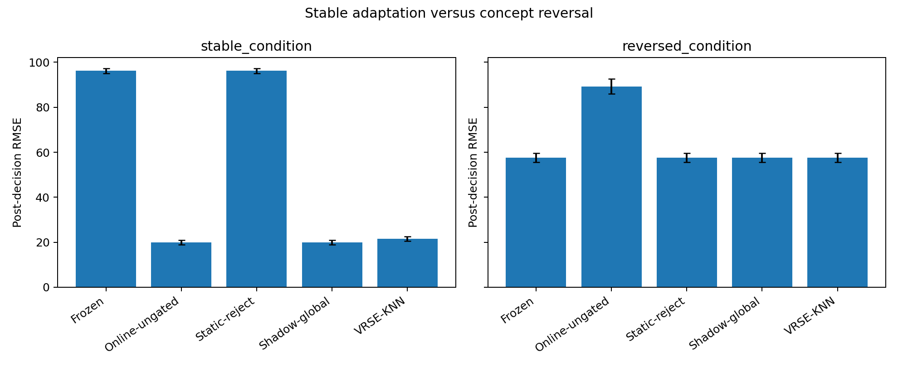
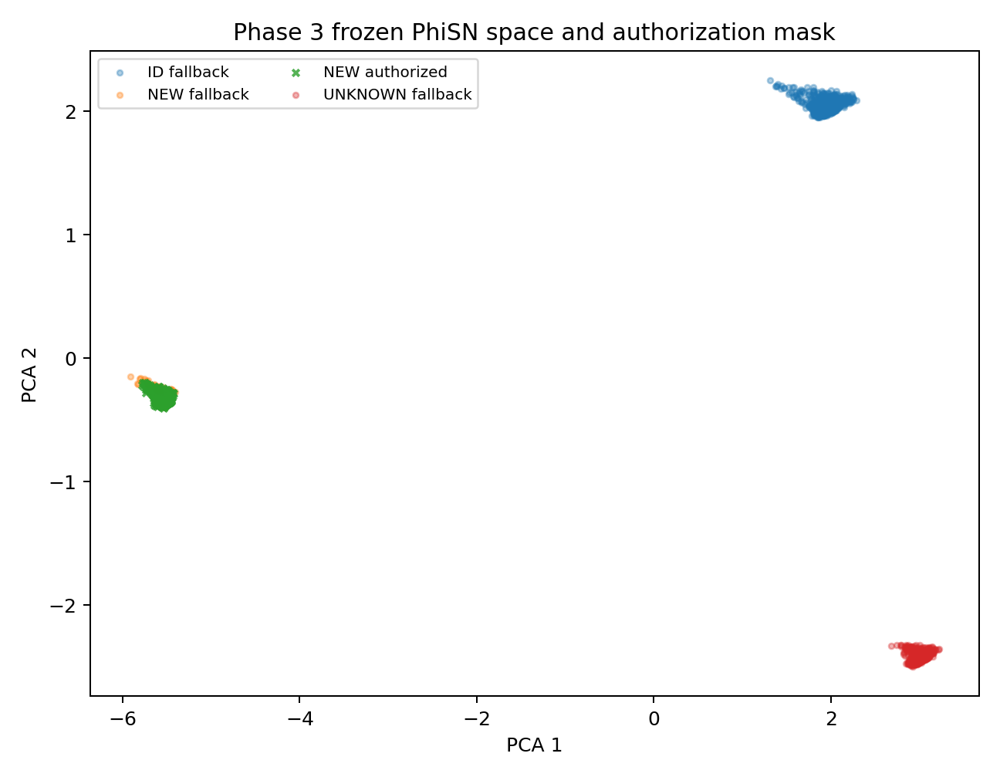
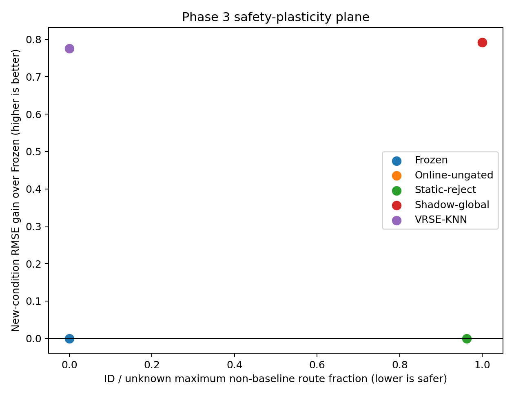

# VRSE

[](https://doi.org/10.5281/zenodo.21653095)

### Let online models learn without letting unverified updates serve

**Validated Regional Support Expansion (VRSE)** is a small PyTorch research library
for a conservative form of online adaptation. New data trains an isolated shadow
expert. That expert must pass an independent exam before it can serve, and a passing
expert receives permission only inside the region supported by its evidence.
Everywhere else, requests continue to use the frozen baseline exactly.

[中文说明](README.zh-CN.md) · [Quickstart](#quickstart) ·
[C-MAPSS result](#a-real-24-dimensional-case-study) ·
[Reproduce](#reproducing-the-frozen-result) · [Research scope](docs/RESEARCH_SCOPE.md)


## Why this exists

An online learner usually performs two jobs at once: it learns from recent data and
immediately changes the model that users see. That is convenient when the stream is
stable, but a bad update, a temporary regime or an unsupported input can alter the
service globally.

VRSE makes **learning** and **permission to serve** separate events:

1. The existing baseline is copied, frozen and kept as the default service.
2. New labelled samples update only a shadow residual expert.
3. Held-out new samples test whether the candidate is useful; an old-domain guard
   checks that its proposed region does not invade protected behavior.
4. A passing candidate becomes an immutable deployment snapshot with a bounded
   authorization region.
5. Inputs outside that region still receive the exact frozen baseline output.

The central idea is simple: an update may learn globally in the background, but it
earns only the deployment permission that the available evidence can justify.

## Quickstart

VRSE is currently a source-distributed research alpha. From a clone:

```bash
python -m pip install -e .
python -m examples.quickstart
```

The public lifecycle is deliberately small:

```python
from vrse import VRSEConfig, VRSEModel

model = VRSEModel.wrap(
    baseline=baseline,
    config=VRSEConfig(preset="regional_regression_highdim"),
)

model.fit(x_id, y_id, x_id_calibration)       # freeze the known service
model.observe(x_new, y_new)                   # update only the shadow candidate
proposal = model.evaluate(x_validation, y_validation, guard_x=x_id_guard)
promoted = model.promote(proposal)            # atomic, single-use decision
y_hat = model(x)                              # regional expert or exact fallback
```

The four data roles are intentionally different. `fit` establishes the old service;
`observe` trains the candidate; `evaluate` uses held-out evidence; and `guard_x`
protects old behavior. Reusing the same samples across these roles weakens the meaning
of promotion.

See [examples/quickstart.py](examples/quickstart.py) for a deterministic synthetic
walkthrough and [examples/real_stream_cmapss.py](examples/real_stream_cmapss.py) for
the frozen real-task lifecycle.

Expected output from the deterministic walkthrough:

```text
VRSE quickstart
  isolated learning max output change : 0.000e+00
  promotion passed                    : True
  new-region route fraction           : 1.000
  new-region RMSE before -> after      : 2.500 -> 0.003
  old-region max fallback difference  : 0.000e+00
  unknown max fallback difference     : 0.000e+00
```

## What is guaranteed by the implementation

When the documented lifecycle is followed:

- `observe()` cannot change the currently served snapshot.
- A proposal binds the baseline, configuration, candidate and authorized region that
  were evaluated; stale or reused proposals are rejected.
- Promotion is atomic: the tested GP posterior and region are frozen together.
- Outside an authorized region, `model(x)` returns the frozen baseline value exactly,
  rather than approximately preserving it on average.
- One-step rollback restores the previous deployment snapshot.

These are software and routing properties. They are not a statistical certificate
that the baseline is safe, that every unknown input is detected, or that an authorized
expert generalizes beyond its demonstrated support.

## A real 24-dimensional case study

The first representative experiment uses **NASA C-MAPSS FD002**, an industrial
simulation benchmark for turbofan remaining-useful-life prediction. Each observation
contains three operating settings and 21 sensor values. The benchmark is simulated,
not field data from operating aircraft.

The frozen study assigned entire engines to disjoint roles, used five seeds and paired
two streams:

- **Stable condition:** the new operating regime remains learnable after observation.
- **Reversed condition:** the inputs are identical, but validation labels are inverted
  to create a candidate that should not be promoted.

The protocol, implementation and result artifacts are frozen under
`phase3b-discovery-global-normalization-v1`.

| Result across five seeds | Frozen baseline | VRSE |
|---|---:|---:|
| Stable new-regime RMSE, mean | 96.18 | **21.61** |
| Stable new-regime RMSE reduction | — | **77.5%** |
| Stable candidates promoted | — | **5/5** |
| Reversed candidates falsely promoted | — | **0/5** |
| New-regime expert routing | — | **93.0–96.0%** |
| ID / adjacent-unknown expert routing | — | **0.0% / 0.0%** |

The stable result is not produced by rejecting everything: most supported new-regime
samples use the promoted expert, reducing error by roughly 4.5×. At the same time,
the protected ID and adjacent unknown regime remain on the exact baseline.



The left panel shows that VRSE recovers most of the utility of globally serving the
shadow expert. The right panel shows why isolation matters: under concept reversal,
the ungated online learner serves a harmful update, while VRSE rejects the candidate
and returns to the baseline. The reversed-label exam changes both the candidate error
and the baseline denominator, so it should be read as a controlled rejection test—not
as evidence that candidate degradation alone caused rejection.

<p align="center">
  
  
</p>

In the frozen feature projection, the promoted region covers the demonstrated new
condition while leaving the ID and adjacent unknown clusters on fallback. The
safety–plasticity plot shows the trade-off directly: global adaptation is useful but
interferes everywhere; static rejection avoids interference but never adapts; VRSE
occupies the useful, low-interference corner in this experiment.

Full evidence: [frozen snapshot](results/PHASE3B_SNAPSHOT.md),
[mechanical verdict](results/PHASE3_RESULT.md),
[per-seed metrics](results/phase3_metrics_table.md), and
[protocol](docs/Phase3_Plan.md).

## Reproducing the frozen result

C-MAPSS is not redistributed by this repository. Obtain it from the
[NASA dataset page](https://data.nasa.gov/dataset/cmapss-jet-engine-simulated-data),
extract it to `data/CMAPSSData/`, then run:

```bash
python -m pip install -e ".[benchmark,test]"
python -m experiments.phase3_prepare_data \
  --source data/CMAPSSData \
  --source-origin user-attested-original-extraction
python -m experiments.phase3_preconditions
python -m experiments.phase3_matrix
python -m experiments.phase3_verdict
python -m experiments.phase3_visualize
```

Do not continue past preconditions unless the verdict is `READY_FOR_MATRIX`. Detailed
checks, Windows commands and provenance notes are in
[docs/Phase3_Runbook.md](docs/Phase3_Runbook.md). The exact frozen files are identified
by [results/phase3b_snapshot.sha256](results/phase3b_snapshot.sha256). The public
release includes the frozen matrix and checkpoints named by that manifest; the
prepared C-MAPSS array is excluded and must be regenerated from the source dataset.

## API and current scope

```text
VRSEModel.wrap(...)    create a private frozen baseline and empty shadow service
model.fit(...)         establish features, fit-time GP and ID uncertainty threshold
model.observe(...)     update only the isolated shadow posterior
model.evaluate(...)    create an auditable, single-use promotion proposal
model.promote(...)     atomically authorize the tested regional snapshot
model.revoke()         restore one previous deployment snapshot
model(x)               route to the expert only where authorization holds
model.route_mask(x)    expose routing decisions for audit
```

Version `0.1.0a1` supports supervised scalar regression, one active regional residual
expert, CPU execution, SNGP-style distance-aware features and either a 1-D observed
span or a high-dimensional KNN feature region. It is a research prototype, not a
drop-in safety layer for arbitrary models.

## What this project does not claim

- It does not solve continual learning or catastrophic forgetting in general.
- It does not guarantee that SNGP uncertainty detects every distribution shift.
- It does not certify closed-loop, clinical, financial or other high-stakes safety.
- It has not yet validated classification, delayed labels, adversarial streams,
  multiple simultaneous experts or repeated region composition.
- The Phase-3 result is a mechanism study, not a C-MAPSS leaderboard claim.

The negative and invalid intermediate experiments are retained because they explain
why the final design looks the way it does. The concise
[research scope](docs/RESEARCH_SCOPE.md) separates the frozen evidence from open
questions; the public release keeps the evidence needed to audit the final claims.

## Project status and citation

The core lifecycle and the Phase-3B case study are frozen. Version `0.1.0a1` is the
first public research software release corresponding to that result. It is a research
preview: the API is not promised stable, and the package is not production ready.
The immutable version archive is available from
[Zenodo](https://doi.org/10.5281/zenodo.21653095). See
[CHANGELOG.md](CHANGELOG.md), [CITATION.cff](CITATION.cff) and the
[release checklist](docs/RELEASE_CHECKLIST.md).

Published by **Byte-Naut**, an independent open-source research identity.

> Byte-Naut. (2026). *VRSE-PyTorch v0.1.0a1: Validated Regional Support Expansion
> for Safe Online Adaptation* [Computer software]. Zenodo.
> https://doi.org/10.5281/zenodo.21653095

VRSE is released under the [Apache License 2.0](LICENSE). The project name and
package identify this research implementation; they do not imply a safety
certification or endorsement by NASA or any other organization.
