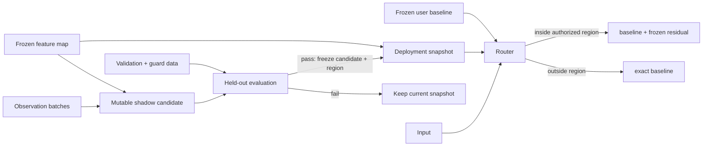

# Architecture

VRSE is organized around one separation: mutable learning state is never the same
object as the immutable state used for serving.



## Public lifecycle

`VRSEModel` exposes eight operations:

| Operation | Effect on learning state | Effect on served state |
|---|---|---|
| `wrap` | creates empty candidate state | privately copies and freezes the baseline |
| `fit` | initializes frozen features and residual statistics | establishes baseline-only service |
| `review_mask` | flags baseline-unfamiliar inputs not covered by the current route | none |
| `observe` | updates only the shadow posterior | none |
| `evaluate` | freezes a proposed candidate and region if checks pass | none |
| `promote` | consumes a single-use proposal | atomically replaces the deployment snapshot |
| `revoke` | leaves current candidate available for later work | restores one previous snapshot |
| `forward` / `route_mask` | none | predicts and exposes routing for audit |

## State machine

- `QUARANTINE`: no candidate has permission to serve.
- `PENDING_EVAL`: a proposal was issued from the current candidate.
- `AUTHORIZED`: a frozen deployment snapshot is active.
- `REVOKED`: transient audit event; the model immediately rests in `QUARANTINE` or
  `AUTHORIZED`, depending on whether an older snapshot existed.

Observation can continue while a snapshot is authorized. The live shadow may change,
but serving continues to read the frozen snapshot until another proposal is evaluated
and promoted.

## Deployment snapshot

A snapshot binds:

- a frozen residual posterior;
- an immutable authorization-region descriptor;
- the region uncertainty threshold;
- configuration version; and
- the proposal fingerprints/token that authorize installation.

The snapshot is the atomic unit of promotion and rollback. The current alpha stores
only one restore point.

## Routing

The router first computes the user baseline `b = baseline(x)`. If no snapshot is
authorized, it returns `b`. Otherwise it obtains a Boolean mask from the snapshot's
region:

```python
residual = where(in_region, frozen_expert(x), 0)
return baseline(x) + residual
```

The literal zero makes fallback exact up to the baseline's own deterministic numeric
behavior. It does not depend on regularization or a small average forgetting score.

## Region descriptors

### One-dimensional observed span

The span is built from observation and validation inputs. Construction fails if it
is empty, touches configured scan boundaries or overlaps protected ranges. Guard
samples must remain outside the region.

### Multidimensional KNN feature region

Evaluation freezes a bounded prototype set in the feature space. A query is
authorized only if both its kth-neighbour distance and candidate uncertainty are
within frozen thresholds. Later observations cannot move the prototypes or thresholds
of the serving snapshot.

## Proposal integrity

The proposal includes fingerprints for baseline parameters, configuration and
candidate state, plus a freshly issued single-use token. Promotion recomputes live
fingerprints and rejects stale or forged proposals. A new observation after review
therefore requires a new review.

This mechanism guards the in-process lifecycle; it is not a cryptographic artifact
signature or a distributed deployment protocol.

## Code map

| Path | Responsibility |
|---|---|
| `vrse/model.py` | public lifecycle, state transitions, proposal validation and routing |
| `vrse/_algorithm.py` | frozen features, posterior updates, calibration and region builders |
| `vrse/config.py` | reference presets and explicit thresholds |
| `vrse/proposal.py` | proposal value object |
| `benchmarks/` | C-MAPSS data contract and comparison methods |
| `experiments/` | reproducible C-MAPSS entry points |
| `results/` | frozen public evidence |

The `benchmarks` and `experiments` packages are research harnesses, not part of the
installed `vrse` package.

## Current constraints

- scalar output only;
- one active regional expert;
- CPU is the validated execution path;
- no concurrent writer/process coordination;
- no multi-snapshot persistence protocol;
- no guarantee that feature-space proximity represents semantic support.

These constraints are intentional release boundaries, not hidden roadmap items.
